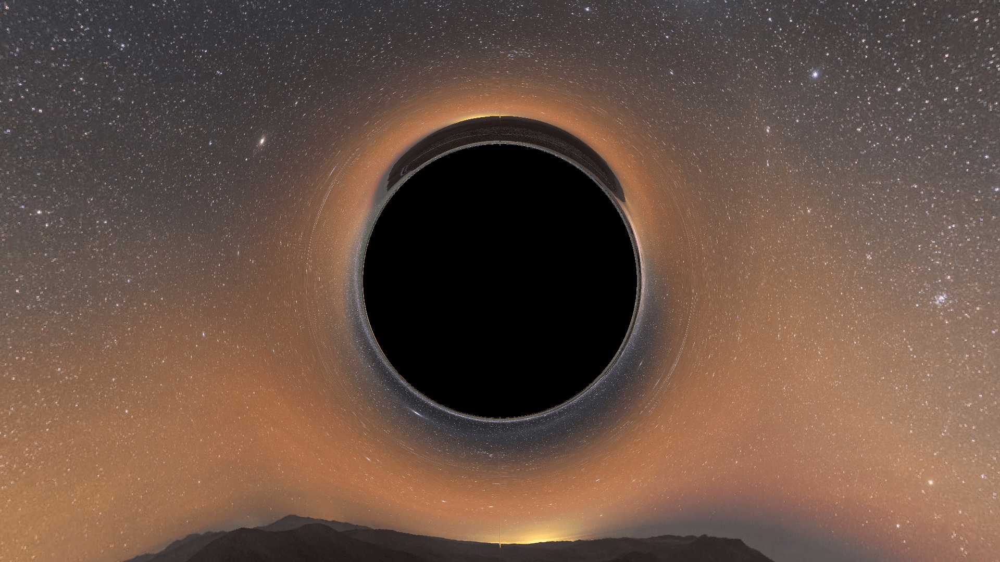
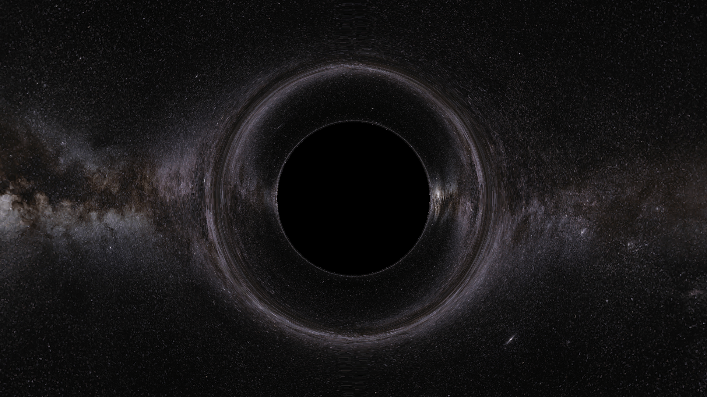

# Black hole pathtracer

Authors: Ben Hughes

README last updated: 03/24/2025

This project is capable of pathtracing null geodesics and recovering images around selected spacetimes -- in particular, this project can currently generate images of Schwarzschild black holes and in Minkowski spacetime using both spherical and Cartesian coordinates. Image generation can be accelerated with CUDA capable GPUs and multithreading is supported.

The camera position, field of view, and other related quantities can be altered inside the `config.json file` contained in the root directory of the project.

<p float=left>
    
    
</p>

## Installation and usage

Installation is currently only supported on UNIX machines (MacOS, Linux) via a Makefile. The Makefile could be pretty easily backwards engineered for a Windows platform, but I didn't take the time to do this. This program supports multithreading via OpenMP and GPU-acceleration via CUDA. The Makefile should automatically detect whether the CUDA compiler `nvcc` is installed, but in case this fails, the variable `HAS_NVCC` can be manually set to `1` or `0`.

Here is the general outline of installation and usage.

1. Clone the repository into whatever folder you want.
```console
user@hostname:~$ git clone https://github.com/BennettHughess/Pathtracer
``` 
2. Navigate to the repository (important). Open the Makefile and configure the `CXX` variable so that the correct compiler is used; the default is probably `g++` or `clang++`. Run `make`.
```console
user@hostname:~$ cd Pathtracer
user@hostname:~/Pathtracer$ make
``` 
3. The Makefile will create the `build`, `bin` folders and compile the executable `main` (located in the `bin` folder). The Makefile will tell you whether the NVIDIA CUDA compiler `nvcc` is detected and the directory of the project folder. Verify that these are correct.
4. The simulation can be configured in the `config.json` file. It will throw a non-fatal error by default: you should adjust the path to the background image in the `config.json` file to resolve the error. I would recommend setting it to `path/to/Pathtracer/images/milky_way.jpg`.
5. After adjusting `config.json` as you please, run the executable `main`. You can optionally specify the name of the output file (which is currently always a png).
```console
user@hostname:~/Pathtracer$ ./bin/main 
user@hostname:~/Pathtracer$ ./bin/main output.png
```
6. The output is, by default, saved in the project directory as `main.png`. 

## Configuration file
The configuration file `config.json`, which is located in the root directory of the project, contains all of the variables which configure the pathtracer. I haven't implemented very comprehensive error checking, so you can definitely break the program by passing bad arguments. Below is an example config file which you can always revert to if you break something (remember to change the `image_path`).

```json
{
    "camera": 
    {
        "position": [0,-10,0],
        "direction": [0,1,0],
        "up": [0,0,1],
        "rotation": [0,0,0],
        "image":
        {
            "width": 1920,
            "height": 1280
        },
        "viewport":
        {
            "fov": 2.1,
            "distance": 1
        }
    },
    "background":
    {
        "radius": 50,
        "type": "Image",
        "image_path": "path/to/Pathtracer/images/milky_way.jpg"
    },
    "scenario":
    {
        "type": "CartesianSchwarzschild",
        "black_hole_mass": 1
    },
    "integrator":
    {
        "type": "CashKarp",
        "dlam": 0.1,
        "max_dlam": 5,
        "min_dlam": 1.0E-20,
        "tolerance": 1.0E-6
    },
    "parallel":
    {
        "parallel_type": 1,
        "threads": 20
    }
}
```

Here's a more verbose description of each of these settings:

- `camera:position` is an $(x,y,z)$ tuple of Cartesian coordinates which specifies the Camera position in space.
    - To be precise, it specifies the Camera position in space *in the camera's coordinates*, which are ordinary flat-space 3D coordinates. This may get converted to differerent coordinates when pathtracing occurs.
- `camera:direction` is a vector describing the direction the Camera faces in $(x,y,z)$ coordinates. For example, $(1,0,0)$ is pointing in the $\hat{x}$ direction.
- `camera:up` is a vector which corresponds to whatever direction is "up" relative to the Camera in $(x,y,z)$ coordinates. This parameter could be adjusted to rotate the Camera, although it's a bit unwieldy. It is required that `up` is orthogonal to `direction`.
- `camera:rotation` is a 3-tuple of angles, in radians that corresponds to the rotation of the camera. This tuple is of the form (pitch, yaw, roll).
- `camera:image:width` and `camera:image:height` correspond to the width and height of the ouput image in pixels.
    - Note: currently, for thread reasons, the width and height of the image must be divisible by 16 when the code is GPU-accelerated.
- `camera:viewport:fov` is the field of view of the Camera in radians (larger -> wider view).
- `camera:viewport:distance` is the distance from the Camera origin to the viewport plane. You don't need to adjust this for any reason, I think.
- `background:radius` is the radius of the enclosing background sphere. The Camera should reside inside the background sphere.
    - A larger radius will increase pathtracing time. If the radius is too small, some artifacts may start appearing. This artifacts also appear if the camera is too close to the background.
- `background:type` may be one of the following types: `Image` or `Layered`. If `type` is set to `Image`, then the specified image located at `image_path` will be used to color the background. If `type` is set to `Layered`, then a placeholder background will be used.
- `background:image_path` should be a path to the image you wish to use as a background.
    - Only a small number of image types are supported. At the very least, `.png` and `.jpg` files are supported.
- `scenario:type` can be one of the following types. Generally speaking, the Cartesian versions are recommended (as the produce better images with lower tolerances).
    - `SphericalMinkowski` is flat spacetime in spherical coordinates.
    - `CartesianMinkowski` is flat spacetime in Cartesian coordinates.
    - `Schwarzschild` is the Schwarzschild metric in Schwarzschild coordinates.
    - `CartesianSchwarzschild` is the Schwarzschild metric in isotropic Cartesian coordinates ([see this source for the reference](https://arxiv.org/abs/0904.4184)).
- `integrator:type` can be of the following types. Not every integrator is supported with GPU acceleration. `CashKarp` is recommended.
    - `Euler` is the standard Euler integrator. Not supported on the GPU.
    - `Verlet` is the [Verlet integrator](https://en.wikipedia.org/wiki/Verlet_integration). Not supported on the GPU.
    - `RK4` is the standard RK4 integrator. Supported on the GPU.
    - `RKF45` is the [RKF45 integrator](https://en.wikipedia.org/wiki/Runge%E2%80%93Kutta%E2%80%93Fehlberg_method), which is an adaptive integrator. Not supported on the GPU.
    - `CashKarp` is the [Cash-Karp integrator](https://en.wikipedia.org/wiki/Cash%E2%80%93Karp_method), which is also an adaptive integrator. Supported on the GPU.
- `integrator:dlam` is the step-size taken by the integrator. For adaptive integrators, this is only used to set the initial step size. For non-adaptive integrators, this is used throughout the entire pathtrace.
    - Note that that this is *not* a physical step size in space, but rather the step size of the affine parameter $\lambda$ used in the [geodesic equation](https://en.wikipedia.org/wiki/Geodesics_in_general_relativity) (on the Wikipedia page, this is the parameter $s$). For example, this would correspond to the proper time for a timelike path.
- `integrator:max_dlam` is the maximum step size that adaptive integrators are permitted to use. Unused by nonadaptive integrators.
- `integrator:min_dlam` is the minimum step size that adaptive integrators are permitted to use. Unused by nonadaptive integrators.
- `integrator:tolerance` is the tolerance parameter that adaptive integrators use to adapt their step size.
    - The exact meaning of this parameter is subject to change, but presently the Cash-Karp integrator computes the next step size via 
    $$0.9 \cdot d\lambda \cdot (\text{tol} \cdot \text{fractional error})^{(1/5)}$$ 
- `parallel:parallel_type` can take on the following values, corresponding to the degree of parallization used.
    - `0` corresponds to a single thread on the CPU.
    - `1` corresponds to multithreading on the CPU.
    - `2` corresponds to GPU acceleration, which works only if `nvcc` is detected and the program is configured properly with the Makefile.
- `parallel:threads` is the number of threads utilized by the CPU when the program is configured to use multithreading.

## (Potentially) common issues

- The program may fail to pathtrace - this could happen if your device doesn't support the `parallel_type` parameter you're passing. For example, setting `"parallel_type": 2` will lead to a fatal error on devices which do not have CUDA support (or which were incorrectly compiled as if they didn't have CUDA support).
    - In the latter case, ensure that the Makefile is recognizing `nvcc` as installed. You may need to manually configure the makefile.
- The program might get stuck in an infinite loop of pathtracing or could finish far too quickly. Check that your tolerances aren't too small.
    - The program should instantly finish and print a monotone screen if the camera position is located outside of the "background sphere".
- You *cannot* place the Camera inside the event horizon of the black hole. Don't try. It will finish instantly with an all-black screen.

## Acknowledgements

This project utilizes the [nlohmann json](https://github.com/nlohmann/json) library for JSON parsing and the [std_image](https://github.com/nothings/stb/blob/master/stb_image.h) and [std_image_write](https://github.com/nothings/stb/blob/master/stb_image_write.h) libraries to handling reading/writing to PNGs.